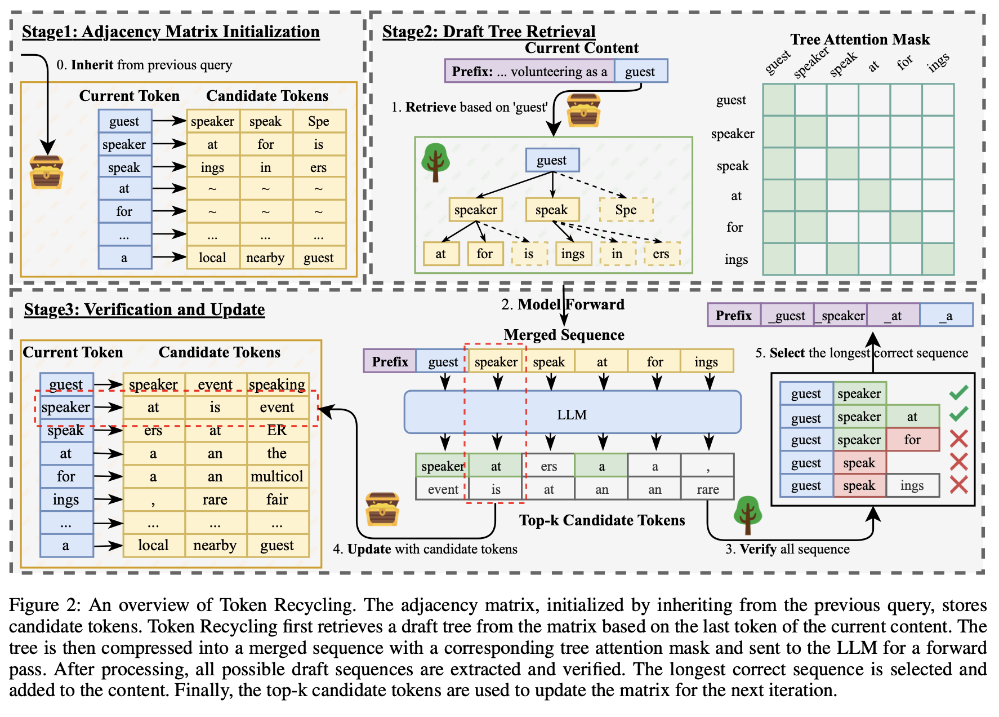

# Token Recycling ♻️

(Unofficial) implementation of the self-speculative LLM decoding method described in [Turning Trash into Treasure: Accelerating Inference of Large Language Models with Token Recycling](https://arxiv.org/abs/2408.08696).

>🚀 **Fast**: ~2x speedup over baseline [SpecBench](https://github.com/hemingkx/Spec-Bench) on A100. (MAT 2.5)
>
>🎮 **Plug n Play**: no training and no architecture changes.
>
>🔮 **Self-Speculative**: no draft model needed.



## Installation

```bash
pip install -r requirements.txt
```

## Usage

```bash
python -m src.cli
```
or
```python
from src.model.token_recycling import TokenRecycling

model = TokenRecycling.from_pretrained("HuggingFaceTB/SmolLM2-135M")
output = model.generate("Your prompt here")
```

## Benchmarks

- [Spec-Bench](https://github.com/smpanaro/Spec-Bench/tree/recycling)
- Device: a single NVIDIA A100 GPU (40GB) with 30 CPU cores
- Testing environment: Pytorch 2.5.1, under CUDA 12.4
- Experimental Settings: greedy decoding, FP16 precision, batch size = 1
- Single run (not average of 3 runs like the official leaderboard)
- Cold Start means the Token Recycling adjacency matrix was reset for each prompt.

### Vicuna-7B-v1.3

> [!NOTE]
> This only includes methods that don't require extra parameters. Other methods like EAGLE and Hydra score better (+0.01-0.21x). Refer to the official [Leaderboard](https://github.com/hemingkx/Spec-Bench/blob/main/Leaderboard.md#leaderboard-on-a100).

| Models                                                             | Multi-turn Conversation | Translation | Summa-rization | Question Answering | Mathematical Reasoning | Retrieval-aug. Generation | #Mean Accepted Tokens |  Overall  |
| ------------------------------------------------------------------ | :---------------------: | :---------: | :------------: | :----------------: | :--------------------: | :-----------------------: | :-------------------: | :-------: |
| [Recycling](https://github.com/smpanaro/token-recycling)           | 2.24x                   | 1.87x       | 2.08x          | 1.99x              | 2.50x                  | 1.80x                     | 2.67                  | 2.08x     |
| [Recycling](https://github.com/smpanaro/token-recycling) Cold Start| 2.07x                   | 1.30x       | 2.23x          | 1.70x              | 2.30x                  | 1.95x                     | 2.55                  | 1.93x     |
| [PLD](https://github.com/apoorvumang/prompt-lookup-decoding)       | 1.56x                   | 1.00x       | 2.54x          | 1.13x              | 1.55x                  | 1.80x                     | 1.75                  | 1.60x     |
| [Lookahead](https://lmsys.org/blog/2023-11-21-lookahead-decoding/) | 1.45x                   | 1.13x       | 1.31x          | 1.20x              | 1.50x                  | 1.16x                     | 1.64                  | 1.30x     |
